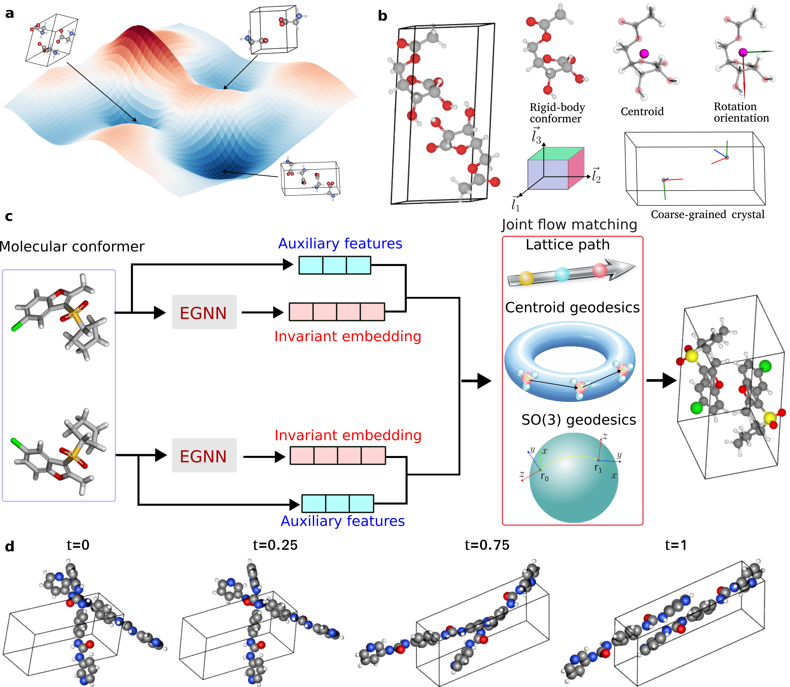

# MolCrystalFlow: Molecular Crystal Structure Prediction with Flow Matching

[](https://arxiv.org/abs/2602.16020)

<p align="center">
  
</p>

## Table of Contents
- [Installation](#installation)
- [Dataset & checkpoints](#dataset--checkpoints)
- [Training](#training)
- [Inference](#inference)
- [Analysis](#analysis)
  - [Structure Matching](#structure-matching)
  - [Lattice Volume Comparison](#lattice-volume-comparison)
- [CSP Pipeline](#csp-pipeline)
- [Citation](#citation)
- [Acknowledgements](#acknowledgement)

---

## Installation

### Clone repository
```bash
git clone https://github.com/Liu-Group-UF/MolCrystalFlow 
cd MolCrystalFlow
```

### Setup environment

```bash
mamba env create -f environment.yml python=3.12
mamba activate molcrystalflow
```

## Dataset & checkpoints

> **Note:** Data preprocessing workflows and dataset-specific preparation steps are documented in the `data-preprocess/` folder.

Pre-trained model checkpoints with the lowest validation losses are available in the `model-checkpoints/` directory:
- `model-checkpoints/thurlemann23/` - Trained on Thürlemann dataset
- `model-checkpoints/omc25-mcf/` - Trained on OMC25-MCF dataset

## Training

### Quick Start

```python
# Train on Thürlemann dataset
python -m molcrystalflow.experiments.train \
    --config-name=molcrystal.yaml \
    experiment.wandb.name=<experiment_name> \
    experiment.trainer.max_epochs=300 \
    data.cache_dir=./data-preprocess/thurlemann23/preprocessed/normalized

# Train on OMC25-MCF dataset
python -m molcrystalflow.experiments.train \
    --config-name=omc25_molcrystal.yaml \
    experiment.wandb.name=<experiment_name> \
    experiment.trainer.max_epochs=500 \
	model.bb_embedder.num_atom_types=12 \ 
    data.cache_dir=./data-preprocess/omc25-mcf/preprocessed/normalized
```

### Resume training from checkpoint

To continue training from `<ckpt_path>` in experiment `<expname>`

```python
python -m molcrystalflow.experiments.train \
    experiment.wandb.name=<expname> \
    experiment.warm_start=<ckpt_path> \
    +experiment.wandb.id=<run_id> \
    +experiment.wandb.resume=must
```

## Inference 

### Quick Start

```python
# Run inference with a trained checkpoint
python -m molcrystalflow.experiments.inference \
    --config-name=inference.yaml \
    inference.ckpt_path=<path/to/checkpoint.ckpt> \
    data.cache_dir=./data-preprocess/thurlemann23/preprocessed/normalized \
    interpolant.sampling.num_timesteps=50 \
    interpolant.rots.exp_rate=3 \
    interpolant.trans.scaling=9 \
    inference.num_samples=10
```

### Key Parameters

| Parameter | Description | Recommended |
|-----------|-------------|-------------|
| `interpolant.sampling.num_timesteps` | Number of integration steps | 50 |
| `interpolant.trans.scaling` | Scaling for centroid coordinates | 9.0 |
| `interpolant.rots.exp_rate` | Scaling for rotation orientations | 3.0 |
| `inference.num_samples` | Number of samples to generate per structure | 10 |

## Analysis

After inference completes, a `predictions_K.pt` file is generated in the `inference/` subfolder of the checkpoint directory (where K is the number of samples). The following scripts analyze these predictions.

### Structure Matching

Evaluate generation qualtiy via `pymatgen`'s StructureMatcher:

```python
python -m molcrystalflow.experiments.run_structure_matching \
    --pt_file <path/to/predictions_K.pt> \
    --num_samples K \
    --stol 0.8 \
    --num_cpus 24
```

This script:
1. Generates ground truth (`gt_*.xyz`) and predicted (`pred_*.xyz`) XYZ files
2. Performs structure matching using pymatgen StructureMatcher
3. Saves RMSD results to CSV and matching summary to JSON

| Parameter | Description | Default |
|-----------|-------------|---------|
| `--pt_file` | Path to predictions_K.pt file | Required |
| `--num_samples` | Number of samples per structure (`K`) | Required |
| `--stol` | Atomic position tolerance | 0.8 |
| `--ltol` | Lattice length tolerance | 0.3 |
| `--angle_tol` | Lattice angle tolerance (degrees) | 10.0 |
| `--num_cpus` | CPUs for parallel processing | 24 |
| `--cg` | Coarse-grained matching | False |

### Lattice Volume Comparison

Compare lattice volumes between ground truth and predicted structures:

```python
python -m molcrystalflow.experiments.run_lattice_volume_analysis \
    --gt_file <path/to/gt_*.xyz> \
    --pred_file <path/to/pred_*.xyz> \
    --num_samples K \
    --output_dir <path/to/output>
```

This script:
1. Extracts lattice volumes from ground truth and predicted XYZ files
2. Computes RMAD (Relative Mean Absolute Deviation) and per-structure deviations
3. Generates publication-quality figures:
   - KDE parity plot (PDF)
   - Deviation boxplot (PDF)
   - Lattice parameter comparison (PDF)
4. Saves summary statistics to JSON

| Parameter | Description | Default |
|-----------|-------------|---------|
| `--gt_file` | Path to ground truth XYZ file | Required |
| `--pred_file` | Path to predicted XYZ file | Required |
| `--num_samples` | Number of samples per structure | Required |
| `--output_dir` | Output directory for figures | Same as gt_file |
| `--prefix` | Prefix for output files | lattice_volume |
| `--kde_cmap` | Colormap for KDE parity plot | viridis |

### Example: Full Analysis Pipeline

```python
# 1. Run inference
python -m molcrystalflow.experiments.inference \
    --config-name=inference.yaml \
    experiment.ckpt_path=./model-checkpoints/thurlemann23/best.ckpt \
    data.cache_dir=./data-preprocess/thurlemann23/preprocessed/normalized \
    inference.num_samples=10

# 2. Run structure matching (generates XYZ files)
python -m molcrystalflow.experiments.run_structure_matching \
    --pt_file ./model-checkpoints/thurlemann23/inference/predictions_10.pt \
    --num_samples 10 \
    --stol 0.8

# 3. Run lattice volume analysis (with custom colormap)
python -m molcrystalflow.experiments.run_lattice_volume_analysis \
    --gt_file ./model-checkpoints/thurlemann23/inference/gt_thurlemann23.xyz \
    --pred_file ./model-checkpoints/thurlemann23/inference/pred_thurlemann23.xyz \
    --num_samples 10 \
    --kde_cmap plasma
```

## CSP Pipeline

> **Note:**Crystal structure prediction pipeline workflows are documented in the `csp-pipeline/` folder.

## Citation

If find MolCrystalFlow or the processed open datasets useful, please cite: 

```bibtex
@misc{zeng_molcrystalflow_2026,
	title = {{MolCrystalFlow}: {Molecular} {Crystal} {Structure} {Prediction} via {Flow} {Matching}},
	shorttitle = {{MolCrystalFlow}},
	url = {http://arxiv.org/abs/2602.16020},
	doi = {10.48550/arXiv.2602.16020},
	urldate = {2026-02-26},
	publisher = {arXiv},
	author = {Zeng, Cheng and Sullivan, Harry W. and Egg, Thomas and Martirossyan, Maya M. and Höllmer, Philipp and Jin, Jirui and Hennig, Richard G. and Roitberg, Adrian and Martiniani, Stefano and Tadmor, Ellad B. and Liu, Mingjie},
	month = feb,
	year = {2026},
	note = {arXiv:2602.16020 [cs]},
	keywords = {Computer Science - Machine Learning, Condensed Matter - Materials Science},
}
```

If you use the Thürlemann dataset, please also cite:

```bibtex
@article{thurlemann_regularized_2023,
	title = {Regularized by {Physics}: {Graph} {Neural} {Network} {Parametrized} {Potentials} for the {Description} of {Intermolecular} {Interactions}},
	volume = {19},
	issn = {1549-9618},
	shorttitle = {Regularized by {Physics}},
	url = {https://doi.org/10.1021/acs.jctc.2c00661},
	doi = {10.1021/acs.jctc.2c00661},
	number = {2},
	urldate = {2026-02-26},
	journal = {Journal of Chemical Theory and Computation},
	publisher = {American Chemical Society},
	author = {Thürlemann, Moritz and Böselt, Lennard and Riniker, Sereina},
	month = jan,
	year = {2023},
	pages = {562--579},
}
```

> **License:** The Thürlemann dataset is licensed under the [CC BY-NC-SA 4.0](https://creativecommons.org/licenses/by-nc-sa/4.0/) license (Creative Commons Attribution-NonCommercial-ShareAlike 4.0 International). Original raw HDF data and the corresponding `README.md` can be retrieved from the [link](https://www.research-collection.ethz.ch/entities/researchdata/9e0da707-f519-475e-a1f3-60d51a64b039).

If you use the OMC-MCF dataset, please cite:
```bibtex
@misc{gharakhanyan2025_OMC25,
	title = {Open {Molecular} {Crystals} 2025 ({OMC25}) {Dataset} and {Models}},
	url = {http://arxiv.org/abs/2508.02651},
	doi = {10.48550/arXiv.2508.02651},
	urldate = {2025-08-05},
	publisher = {arXiv},
	author = {Gharakhanyan, Vahe and Barroso-Luque, Luis and Yang, Yi and Shuaibi, Muhammed and Michel, Kyle and Levine, Daniel S. and Dzamba, Misko and Fu, Xiang and Gao, Meng and Liu, Xingyu and Ni, Haoran and Noori, Keian and Wood, Brandon M. and Uyttendaele, Matt and Boromand, Arman and Zitnick, C. Lawrence and Marom, Noa and Ulissi, Zachary W. and Sriram, Anuroop},
	month = aug,
	year = {2025},
	keywords = {Physics - Chemical Physics},
}
```

> **License:** The OMC25 dataset is provided under a [CC BY 4.0](https://creativecommons.org/licenses/by/4.0/) license (Creative Commons Attribution 4.0 International).

## Acknowledgements
MolCrystalFlow builds upon the following projects:

* [MOFFlow](https://github.com/nayoung10/MOFFlow)
* [DiffCSP](https://github.com/jiaor17/DiffCSP)
* [OMatG](https://github.com/FERMat-ML/OMatG)
